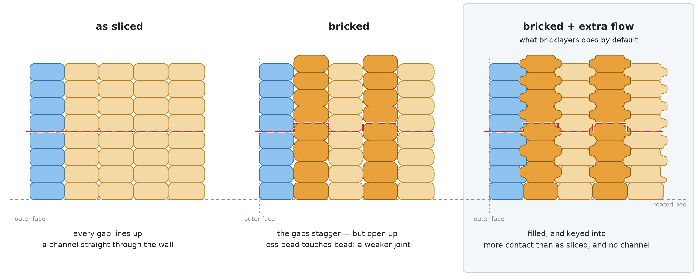

# 🧱 bricklayers

**A G-code post-processor that makes 3D printed layers interlock instead of stacking as independent flat sheets — which is exactly where FDM prints crack.**

<picture>
  <source media="(prefers-color-scheme: dark)" srcset="interlock-dark.png">
  
</picture>

*Seen end-on: columns are perimeter loops, rows are layers, and the red line is the join between two layers — the plane an FDM part splits along.*

**The middle step is the tool doing harm. The third is why it is worth it.**

1. **As sliced.** Two beads laid side by side leave a small gap where their rounded edges meet. Every layer breaks at the same height, so those gaps line up into a channel running straight through the wall — and that channel is where the part splits.
2. **Bricked.** Every other loop rises half a layer, so the gaps no longer line up. But they also get *bigger*: on a flat plane the nozzle's underside presses each gap shut as it passes, and over a staggered seam half of each one is out of its reach. Less bead touches bead than before. On its own, this step makes the joint weaker — which is exactly why it is not the whole story.
3. **Bricked + extra flow.** The material the walls gain fills those gaps and keys into them, so beads seat into each other instead of merely stacking. The wall ends with **more** contact than it had as sliced, and no aligned channel left to split along.

The gaps are the one thing drawn far larger than life — on a 0.2 mm layer they are a few microns across, and at true scale you would see nothing at all. Everything else comes out of the same code the binary uses, including the two details worth knowing: the layer on the build plate is left exactly as sliced, because nothing presses a bead there, and a raised column climbs to its half layer over two layers rather than stepping up in one.

> 💡 **Credit where it's due** — the idea and the research behind it belong to [TengerTechnologies/Bricklayers](https://github.com/TengerTechnologies/Bricklayers) and [GeekDetour/BrickLayers](https://github.com/GeekDetour/BrickLayers).

---

## 📖 Contents

- [✨ Features](#-features)
- [🚀 Install](#-install)
- [🖨️ Use](#️-use)
- [📐 How much flow it adds](#-how-much-flow-it-adds)
- [📄 Licence](#-licence)

---

## ✨ Features

- 🧱 **Layers that key into each other** — every other internal perimeter loop rises half a layer, so the seams stagger instead of lining up into one channel running through the wall.
- 🎛️ **Nothing to fill in** — the line width and the nozzle come from your file and your slicer, and the layer height is measured off the print itself, layer by layer.
- 🎚️ **One dial** — [`--extra-flow`](#-how-much-flow-it-adds), a percentage from `0` to `50` that is `5` if you never set it, and the only thing that changes what comes out.
- 🔬 **Nothing to check first** — PrusaSlicer, SuperSlicer, OrcaSlicer, Bambu Studio and Cura all go through the same code path, with no slicer to pick and no dialect to declare.
- 📦 **One binary** — Linux, macOS and Windows, x86-64 and arm64, and nothing else to install.
- 🪶 **Any file size** — streamed rather than loaded, so a 300 MB slice costs the same 14 MB of memory as a small one.

Compared to [GeekDetour/BrickLayers](https://github.com/GeekDetour/BrickLayers) and [TengerTechnologies/Bricklayers](https://github.com/TengerTechnologies/Bricklayers), both of which are Python scripts that ask you to change slicer settings before they will work, here is what you get instead:

- 🐍 **No Python** — nothing to install and keep working, and no interpreter path in front of the script path in your slicer's field.
- 🎛️ **No numbers to keep in sync** — no `-layerHeight` to match your profile and no extrusion multiplier to guess, because both are read from the file on every layer.
- 🔧 **No slicer settings to change first** — arc fitting stays on, and your wall order is read rather than dictated.
- 🗜️ **Binary G-code just works** — `.bgcode` is read and written natively, thumbnails and slicer config copied byte for byte, where the others need it turned off.
- 🧵 **No stringing from the raise** — a height change rides a travel the printer was already making, instead of stopping the toolhead over a seam with a primed nozzle.
- 🧩 **Two walls are enough** — a region with one internal loop is bricked against the wall you can see rather than skipped, so thin ribs and lone loops are interlocked too.
- 🎨 **The visible wall is in on it** — it takes the same flow as every other wall, and is drawn back in by half of what it gains so its outer face stays exactly where your slicer drew it.
- 🚫 **Nothing else is touched** — infill, bridges, gap fill and the top and bottom surfaces come out metered exactly as sliced, so this is never a global flow bump.
- 🛟 **The awkward files still come out right** — adaptive layer height, absolute extrusion and objects printed one at a time are each metered for what they are.
- ⚡ **Fast** — a 9.4 MB slice goes through both of its passes in 88 ms, so nothing waits on it.
- 🈳 **Any character set** — the file is read as bytes, so an object or filament name in any encoding passes through untouched rather than stopping the run.
- 🔎 **You can see what it did** — every raise is stamped into the exported G-code, so `grep bricklayers` on the file tells you it ran and where, even though a slicer swallows everything a script prints.
- 🛡️ **Your file cannot be destroyed** — it is written aside and moved into place, and a second run over the same file is refused rather than stacking a second shift on the first.

---

## 🚀 Install

**One-liner.** Downloads the latest release into `~/BrickLayers` (`%USERPROFILE%\BrickLayers` on Windows), checks the published SHA-256 sums, and prints the line to paste into your slicer. Run it again any time to update in place.

```sh
# Linux / macOS
curl -fsSL https://raw.githubusercontent.com/erkexzcx/Bricklayers-rust/main/deploy.sh | bash

# Windows (PowerShell)
irm https://raw.githubusercontent.com/erkexzcx/Bricklayers-rust/main/deploy.ps1 | iex
```

> 🛡️ **Windows: "An Application Control policy has blocked this file".** These builds are unsigned, and [Smart App Control](https://support.microsoft.com/en-us/topic/what-is-smart-app-control-285ea03d-fa88-4d56-882e-6698afdb7003) blocks anything unsigned. Turn it off in **Windows Security → App & browser control → Smart App Control settings**.

**By hand.** Take your platform's file from the [latest release](https://github.com/erkexzcx/Bricklayers-rust/releases/latest) — Linux, macOS and Windows, x86-64 and arm64 — rename it to `bricklayers`, put it somewhere permanent and `chmod +x` it. If macOS refuses to run it, approve it in System Settings → Privacy & Security.

**From source.** Needs only [Rust](https://rustup.rs):

```sh
git clone https://github.com/erkexzcx/Bricklayers-rust.git
cd Bricklayers-rust && cargo build --release
```

---

## 🖨️ Use

One line goes into your slicer's **post-processing scripts** field: the binary's absolute path, and nothing else. The slicer appends the G-code path itself.

```
/home/you/BrickLayers/bricklayers
```

On Windows use the full path, quoted if any folder name contains a space:

```
"C:\Users\you\BrickLayers\bricklayers.exe"
```

In OrcaSlicer and Bambu Studio the field is under **Process → Others → Post-processing Scripts**, with the settings mode set to Advanced or Expert. Plain `.gcode` and `.bgcode` are both accepted, and the output keeps whichever came in.

> 🙈 **The preview will not show the change — and that is normal.** Post-processing runs after the slicer has already drawn its preview, so the toolpaths on screen are the *unmodified* ones. Every post-processing script in every slicer behaves this way; the exported file *is* processed. To see the result, export the G-code and open that file back in the slicer.

You can skip the slicer and run it yourself. `-o` writes a new file and leaves the input untouched; drop it and the file is rewritten in place. `-v` says whether anything happened:

```sh
bricklayers -v -o modified.gcode original.gcode
# bricklayers: 240 layers, 1365 internal loops, 533 raised by 0.100 mm
# bricklayers: 13 more were left flat where the wall ends and something is printed over it
# bricklayers: 5064.1 mm filament, 16.6% of it in raised loops; a flow of 1.025 adds 1.07% to the part
```

Zero raised loops means the file gave it nothing to work with — usually a single wall, or region markers spelled in a way that is not recognised.

The full set of options is short, because everything else is read from your file:

```
bricklayers [OPTIONS] <GCODE>
```

| option | |
|---|---|
| `-o, --output <PATH>` | write here instead of overwriting the input |
| `-v, --verbose` | print a summary of what changed |
| `--extra-flow <PERCENT>` | extra flow for the walls, `0` to `50` (default `5`) |
| `--force` | run even on a file already processed, which would stack a second shift on the first |

**`--extra-flow` is a percentage you can reason about.** It is the extra a wall would take if your layer were as thick as your nozzle. A layer half the nozzle takes about half of it — so the default `5` gives about **2.5%** on a 0.2 mm layer through a 0.4 mm nozzle, and a finer layer takes proportionally less, on every layer, without you touching anything. `0` meters every bead exactly as your slicer sliced it and only raises them. See [how much flow it adds](#-how-much-flow-it-adds) below.

---

## 📐 How much flow it adds

**`--extra-flow` is the extra a wall takes when your layer is as thick as your nozzle.** Print thinner than that — everyone does — and you get proportionally less:

> **extra flow ≈ `--extra-flow` × (layer height ÷ nozzle diameter)**

So the default of `5` gives **+2.5%** on a 0.2 mm layer through a 0.4 mm nozzle, because that layer is half the nozzle. Nothing to set; both numbers are read from your file.

**Why those two numbers.** A bead of plastic is not a rectangle in cross-section. It is a rectangle with a half-round bulge on each side. Lay two side by side and a small corner is left empty where the bulges meet; slicers close it by pulling the beads together until the overlap in the middle pays for the corners, and normally the nozzle's flat underside squashes what is left shut as it passes over.

Bricklayers lifts every other wall by half a layer, so that corner is now **half a layer below the nozzle** and out of its reach. The extra flow fills it instead. How big the corner is depends on exactly two things: the **layer height** (taller layer, taller corner) and the **line width** (wider bead, smaller share of it sitting in a corner). Both are stated in your G-code, so both are read, on every layer.

**What the default comes out at.**

| nozzle | line width | layer | layer ÷ nozzle | extra flow |
|---|---|---|---|---|
| 0.2 | 0.22 | 0.06 | 30% | +1.47% |
| 0.2 | 0.22 | 0.10 | 50% | +2.56% |
| 0.4 | 0.45 | 0.08 | 20% | +0.94% |
| 0.4 | 0.45 | 0.12 | 30% | +1.44% |
| 0.4 | 0.45 | 0.16 | 40% | +1.96% |
| **0.4** | **0.45** | **0.20** | **50%** | **+2.50%** |
| 0.4 | 0.45 | 0.24 | 60% | +3.06% |
| 0.4 | 0.45 | 0.28 | 70% | +3.65% |
| 0.6 | 0.65 | 0.15 | 25% | +1.24% |
| 0.6 | 0.65 | 0.20 | 33% | +1.68% |
| 0.6 | 0.65 | 0.30 | 50% | +2.61% |
| 0.8 | 0.85 | 0.20 | 25% | +1.26% |
| 0.8 | 0.85 | 0.28 | 35% | +1.80% |
| 0.8 | 0.85 | 0.40 | 50% | +2.66% |

Read down the 50% rows — 2.56, 2.50, 2.61, 2.66. Nozzle size barely matters on its own; what matters is **how thick your layer is next to your nozzle**, which is why one percentage covers every nozzle. It is `≈` rather than `=` because the flow actually follows the **line width** your file states, not the nozzle, and stock profiles set the width at 1.06 to 1.13 times the nozzle. Across the whole table that keeps it within **±7%** of the simple form; set an unusually narrow or wide line width and it shifts further, correctly.

**If you want more or less of it.** Set `--extra-flow` to anything from 0 to 50:

| `--extra-flow` | 0.4 mm nozzle, 0.2 mm layer | 0.4 mm nozzle, 0.28 mm layer |
|---|---|---|
| `0` | none — metered as sliced | none — metered as sliced |
| `2.5` | +1.25% | +1.83% |
| `5` (default) | +2.50% | +3.65% |
| `10` | +5.00% | +7.31% |
| `50` | +25.0% | +36.5% |

The top of the range is for sweeping a test print rather than for printing with. `0` is a real setting — bricking with the raise and nothing else, every bead metered exactly as your slicer wrote it. There is a ceiling, but it is not a number anyone picked: a bead can be widened until its edge reaches the centre of the loop beside it, past which it is swallowing its neighbour rather than filling the corner between them, and that works out at **×1.89** on the profile above. Swept over every nozzle from 0.2 to 1.2 mm at every layer height from 10% to 80% of it, nothing comes within 15% of it even at `50` — it is there to stop a file stating a width no slicer would emit, not to cap the dial.

This is the one thing worth reaching for if a printed wall tells you the default is wrong — the rest is geometry and stays read from the file. Note that your slicer's own per-filament flow ratio is the better place to compensate for a *material* that fills corners badly, because that affects the infill and the surfaces too.

**What it costs on the whole part.** Much less than the number above, because walls are only part of a print. Measured on two real slices at the default:

| part | filament in raised loops | added to the whole part |
|---|---|---|
| Benchy, 2 walls | 16.6% | **+1.07%** |
| Cylinder, solid wall throughout | 45.5% | **+2.30%** |

Turning your slicer's global flow up instead would tax the infill and the surfaces too.

**What gets it, and what does not.** Every wall, the one you can see included — measured per region on a real Benchy at the default:

| region | flow |
|---|---|
| Outer wall | **×1.0219** |
| Inner wall | **×1.0230** |
| Overhang wall | **×1.0226** |
| Solid infill, sparse infill, gap fill, bridges, top and bottom surface, brim | ×1.0000 |

So it is never a global flow bump. Those three sit a little under the 1.025 the profile asks for because the first layer on the bed is metered as sliced and pulls the average down.

Two things happen inside the walls that are worth knowing:

- **The first layer on the bed is left exactly as sliced.** Nothing presses a bead there, so surplus spreads sideways instead of filling anything. On a Benchy it filled in the recessed nameplate, which is exactly one layer deep.
- **The outer wall gets the flow and is then moved inward by half the width it gains.** Its neighbour is raised like any other, so it has the same staggered joint to feed — but a bead widens about its own centre, so half the gain would push the surface outward. Moving it in by that much sends the gain into the joint behind it and leaves the commanded outer face exactly where the slicer drew it. What it gains is `flow - 1` of its *spacing*, not of its nominal width: the area scales at a fixed height, and the bead's round edges cost the same either way.
- **A `G2`/`G3` arc moves with it.** It keeps the centre it was drawn about and changes radius by the offset — inward for an anticlockwise loop, outward for a clockwise one, which is into the material either way — and the `I`/`J` words that name that centre from the arc's start point are restated, because that start point moved. Measured against the input on two real arc-fitted slices: every moved arc's radius moved the right way, and the gap between the radius an arc is commanded at and the radius its endpoint lands at stayed inside what three-decimal coordinates already put there (0.45 µm at the median, against the input's 0.39 µm). A loop whose arcs cannot be moved without distorting the circle they were drawn on is left exactly as sliced; on a Benchy that is 3 beads of 21396, on a solid cylinder 5 of 684.

**What a printed part measures is a separate question.** The compensation above is exact on the toolpath — the visible wall's commanded outer face lands on the coordinate your slicer chose, down to the micron the three-decimal grid allows. Plastic is looser than a coordinate. Every wall behind the visible one gains material too and is *not* moved, because its gain is meant to fill the staggered joint rather than to be taken back; and a raised bead spends half a layer out of reach of the nozzle's flat underside, so what would normally be ironed flat is free to spread sideways. Both push the same way, and a bricked part can come out slightly over nominal in XY.

If yours does, there are two dials, in this order. `--extra-flow 0` meters every bead exactly as your slicer sliced it and moves no wall at all, leaving only the raise — that is bricking with nothing added, and it is the setting that isolates the raise from the flow. Beyond that, your slicer's XY size compensation trims a measured offset the way it would for any other change in flow.

**Where the two numbers are read from.** Whichever of these states them, in this order: the `SLIC3R_*` configuration your slicer exports when it runs a post-processing script, the metadata blocks of a `.bgcode` container, and the settings block a slicer appends to plain `.gcode`. The keys are `perimeter_extrusion_width` (PrusaSlicer, SuperSlicer) and `inner_wall_line_width` (OrcaSlicer, Bambu Studio); a width given as a percentage is resolved against `nozzle_diameter`. Layer heights are measured from the commanded Z, one layer at a time, so an adaptive slice is metered against what it actually printed rather than against its profile's nominal.

Binary G-code keeps all of this *outside* its G-code stream, so a search of the decoded text finds none of it — the metadata blocks are read instead. Checked against PrusaSlicer's own test files, which state a 0.4 mm nozzle and a 0.45 mm wall and come out at `1.025`.

If a file states no width at all — Cura writes its settings in a form nothing else parses — the walls fall back to the reference profile's flow, and `-v` says so rather than letting a default pass for a measurement. The inward move falls back with it, to the same profile: a wall that gains material without being moved grows the part by half of what it gained, so the two halves of the change are never applied apart.

**Where the formula comes from.** `spacing = width − height × (1 − π/4)` is the slicer's own bead model, not an invention here — PrusaSlicer computes exactly that in [`Flow::rounded_rectangle_extrusion_spacing`](https://github.com/prusa3d/PrusaSlicer/blob/master/src/libslic3r/Flow.cpp), and meters each bead at `height × spacing`. Verified against three real OrcaSlicer slices (0.4 mm nozzle, 0.2 mm layers, 0.45 mm inner wall, `filament_flow_ratio 0.95`): neighbouring loops measured **0.4074 mm** apart against the formula's 0.4071, and each bead metered **0.0773–0.0774 mm²** against the formula's 0.0774. A model that spaced beads at the nominal width would predict 0.0855 — 10.5% out — so any "void" figure derived from nominal width describes a slicer that does not exist.

The default — 5%, which is 2.5% on the commonest profile of all — is a **chosen constant**, not a measured one. It is small on purpose: it is paid on every wall of the part, and it also sets how far the visible wall is drawn in, which nobody wants measured in anything but microns. Only how it *scales* with your geometry is derived.

Published micro-CT work supports the direction, though none of it was used to fit these numbers:

- Faizaan, M. *et al.* **“A study on the overall variance and void architecture on MEX-PLA tensile properties through printing parameter optimisation.”** *Scientific Reports* **15**, 3103 (2025). [doi:10.1038/s41598-025-87348-2](https://doi.org/10.1038/s41598-025-87348-2) — PLA printed at 100% infill with a **concentric** pattern, i.e. the many-walls case. Void area fraction ran **0.117% to 4.99%** of the printed cross-section; the largest voids came from a 0.6 mm nozzle at 0.3 mm layers and the smallest from a 0.8 mm nozzle at 0.15 mm layers. Voids were **axially connected in every reconstruction** — the aligned channel that staggering the seams exists to break up.
- Guessasma, S., Belhabib, S. & Altin, A. **“On the Tensile Behaviour of Bio-Sourced 3D-Printed Structures from a Microstructural Perspective.”** *Polymers* **12**, 1060 (2020). [doi:10.3390/polym12051060](https://doi.org/10.3390/polym12051060) — overall porosity of 3D-printed PLA measured at **5.73%** by micro-CT, and the paper notes the same quantity comes out near **11%** when taken from weight and volume instead.

Both report the void a print has *before* anything is staggered, at a resolution far coarser than the corner this tool feeds. They are evidence that the corner is real and that it grows with layer height against nozzle size, which is exactly what the formula above scales with.

---

## 📄 Licence

GPL-3.0-or-later, matching the project that inspired it.
